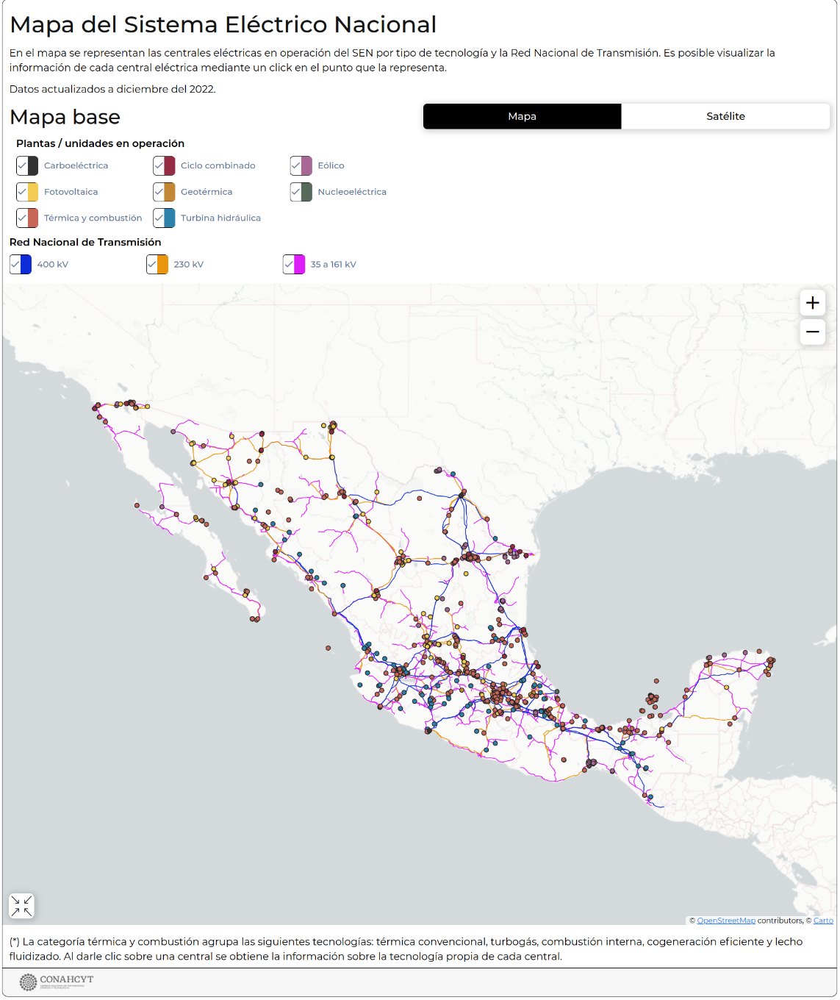

<h1>Impact of OSM grid mapping data </h1>

## **
Who uses OpenStreetMap grid data?
**

This frequently asked question is important to answer to show how mapping is impactful. When you map towers, substations, powerplants in OpenStreetMap (OSM), you are essentially adding valuable data that is used by many different actors. This data is used by the following list, which is not exhaustive.

###  
**International Energy Agency**  {width=30px} 
??? "Latin America Energy Outlook Interactive Map"
    
    === "[Latin America Energy Outlook Interactive Map (link)](https://www.iea.org/data-and-statistics/data-tools/latin-america-energy-outlook-interactive-map)"
        {: .img-border }

###  
**World Bank**  {width=70px} 
??? "Africa Electricity Grids Explorer"
    
    === "[Africa Electricity Grids Explorer (link)](https://africagrid.energydata.info/)"
        {: .img-border }

###  
**CONAHCYT (Gobierno de Mexico)**  {width=70px} 
??? "Mapa del Sistema Eléctrico Nacional"
    
    === "[Mapa del Sistema Eléctrico Nacional (link)](https://energia.conacyt.mx/planeas/electricidad/sistema-electrico-nacional)"
        {: .img-border }

## **
How and why is it used?
**

## **
Why is it important that this data is open?
**

