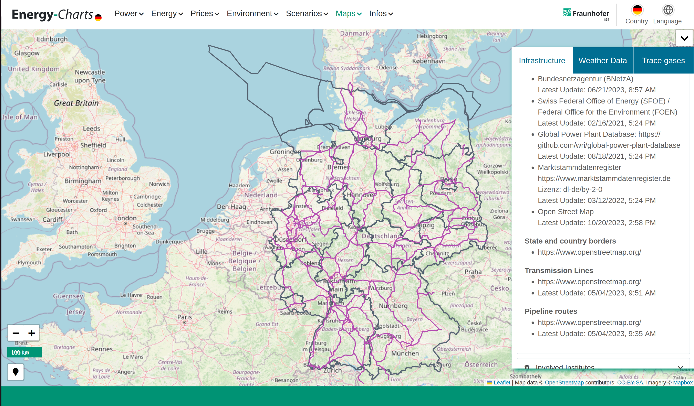

<h1>Impact of OSM grid mapping data </h1>

## **
Who uses OpenStreetMap grid data?
**

This frequently asked question is important to answer to show how mapping is impactful. When you map towers, substations, powerplants in OpenStreetMap (OSM), you are essentially adding valuable data that is used by many different entities. This data has been used by the following list of organisations, which is not exhaustive.
   

**International Energy Agency**  {width=30px} 
??? "Latin America Energy Outlook Interactive Map"
    
    === "[Latin America Energy Outlook Interactive Map (link)](https://www.iea.org/data-and-statistics/data-tools/latin-america-energy-outlook-interactive-map)"
        {: .img-border }

**World Bank**  {width=70px} 
??? "Africa Electricity Grids Explorer"
    
    === "[Africa Electricity Grids Explorer (link)](https://africagrid.energydata.info/)"
        {: .img-border }
 
**CONAHCYT (Gobierno de Mexico)**  {width=70px} 
??? "Mapa del Sistema Eléctrico Nacional"
    
    === "[Mapa del Sistema Eléctrico Nacional (link)](https://energia.conacyt.mx/planeas/electricidad/sistema-electrico-nacional)"
        {: .img-border }
 
**European Commission - Joint Research Centre**  {width=40px} 
??? "Africa Knowledge Platform"
    
    === "[Africa Knowledge Platform (link)](https://africa-knowledge-platform.ec.europa.eu/explore_maps)"
        {: .img-border }

    **More Information**
    - The electricity network data on the image is a mix of World Bank and OpenStreetMap data 
 
**IRENA**  {width=55px} 
??? "Global Atlas for Renewable Energy"
    
    === "[Global Atlas for Renewable Energy (link)](https://globalatlas.irena.org/workspace)"
        {: .img-border }
 
**Global Wind Atlas**  {width=15px} 
??? "Global Wind Atlas"
    
    === "[Global Wind Atlas (link)](https://globalwindatlas.info/en/)"
        {: .img-border }

**Fraunhofer ISE**  {width=45px} 
??? "Energy Charts"
    
    === "[Energy Charts(link)](https://www.energy-charts.info/map/map.htm?l=en&c=DE&country=DE&lines=1110000&pp-source=bnetza&pp-bitmap=none)"
        {: .img-border }

## **
How and why is it used?
**

Our team also ran an "impact analysis" to see how many times the keywords _OpenStreetMap_ AND power related keywords (eg. _power grid_, _electrical grid_, _renewable_, _energy model_, etc...) were used together in google scholar. 

 - 📈 **10,700 publications** since 2005 included a combination of these keywords.
 - 🚀 **7,520 publications** (70% of total) were published in the **last 5 years alone**, which shows the increasingly important role OpenStreetMap power data is having in academia.

## **
Why is it important that this data is open?
**

